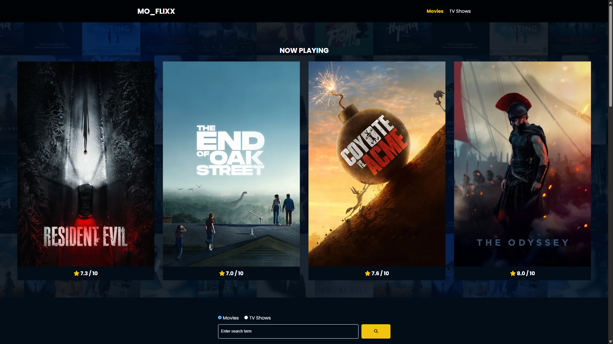

# 🎬 Flixx App

A dynamic, responsive web application for discovering and exploring popular movies and TV shows using **Vanilla JavaScript** and **The Movie Database (TMDB) API**.



---

## 🛠️ Built With

<p align="left">
  
  &nbsp;&nbsp;
  
  &nbsp;&nbsp;
  
</p>

---

## 🌟 Key Features

- 🎬 **Trending Content:** Browse the most popular movies and TV shows updated in real-time.
- 🎠 **Interactive Swiper Slider:** Showcases movies currently playing in theaters.
- 🔍 **Advanced Search & Pagination:** Search for movies or TV shows with multi-page navigation.
- 📄 **Detailed Info Pages:** View ratings, overviews, genres, budgets, revenues, and production companies.
- 🖼️ **Dynamic Backdrop Images:** Custom full-screen fixed overlays generated dynamically based on selected media.
- ⚡ **Loading Spinner:** Smooth UI state feedback during API fetches.

---

## 📁 Project Structure

```text
flixx-app-theme/
│
├── css/
│   ├── spinner.css
│   └── style.css
│
├── js/
│   └── script.js
│
├── images/
│   └── no-image.jpg
│
├── index.html          # Main landing page (Popular Movies & Slider)
├── shows.html          # Popular TV Shows page
├── movie-details.html  # Movie detail view
├── tv-details.html     # TV Show detail view
└── search.html         # Search results page
```
